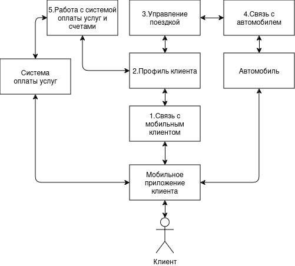

# Отчёт о выполнении задачи "Система управления парком автомобилей"

- [Отчёт о выполнении задачи "Система управления парком автомобилей"](#отчёт-о-выполнении-задачи-name)
  - [Постановка задачи](#постановка-задачи)
  - [Известные ограничения и вводные условия](#известные-ограничения-и-вводные-условия)
    - [Цели и Предположения Безопасности (ЦПБ)](#цели-и-предположения-безопасности-цпб)
  - [Архитектура системы](#архитектура-системы)
    - [Контекст работы системы](#контекст-работы-системы)
    - [Компоненты](#компоненты)
    - [Алгоритм работы решения](#алгоритм-работы-решения)
    - [Описание Сценариев (последовательности выполнения операций), при которых ЦБ нарушаются](#описание-сценариев-последовательности-выполнения-операций-при-которых-цб-нарушаются)
    - [Переработанная архитектура](#переработанная-архитектура)
    - [Указание "доверенных компонент" на архитектурной диаграмме.](#указание-доверенных-компонент-на-архитектурной-диаграмме)
    - [Проверка негативных сценариев](#проверка-негативных-сценариев)
    - [Политики безопасности](#политики-безопасности)
  - [Запуск приложения и тестов](#запуск-приложения-и-тестов)
    - [Запуск приложения](#запуск-приложения)
    - [Запуск тестов](#запуск-тестов)

## Постановка задачи

Компания разрабатывает подсистему удалённого управления ключевыми функциями для нового легкового автомобиля. Основной сценарий эксплуатации - каршэринг - совместное использование автомобиля широким кругом лиц, которые оплачивают подписку на различные наборы сервисов.

Необходимо обеспечить гибкое управление функционалом автомобиля таким образом, чтобы только аутентичный и авторизованный пользователь мог управлять автомобилем в соответствии со своей подпиской.

Отдельные функции, такие как, например, принудительная блокировка двигателя, отключение освещения, могут привести к аварии и ущербу для жизни и здоровья пассажиров в случае если это происходит во время движения.

Программного обеспечения в системе становится критически много, а сроки разработки сжатые, производителю необходимо выпустить свой автомобиль на рынок быстрее конкурентов, чтобы захватить большую долю рынка.

Необходимо **спроектировать систему удалённого управления** устойчивой к атакам как снаружи, так и изнутри системы, чтобы снизить требования к производителям сторонних подсистем и собственным разработчикам - это позволит ускорить и удешевить процесс разработки.

В рамках хакатона участникам предлагается:

- доработать предложенную архитектуру (см. далее) системы управления парком автомобилей с учётом целей безопасности
- декомпозировать систему и отделить критический для целей безопасности код
- в ПО нужно внедрить компонент "монитор безопасности" и реализовать контроль взаимодействия всех подсистем управления парком автомобилей
- доработать функциональный прототип
- создать автоматизированные тесты, демонстрирующие работу механизмов защиты

Ценности, ущербы и неприемлемые события

|Ценность|Неприемлемое событие|Оценка ущерба|Комментарий|
|:--|:--|:--|:--|
|Люди-клиенты|в результате критического сбоя в системе управления пострадали клиенты|высокий||
|Другие люди|в результате критического сбоя в системе управления пострадали другие люди (пешеходы, водители других авто)|высокий||
|Автомобиль|в результате критического сбоя в системе управления пострадал автомобиль|средний|Автомобиль застрахован|
|Имущество третьих лиц|в результате критического сбоя в системе управления пострадало имущество третьих лиц / важная инфраструктура|высокий||
|Операционная прибыль|злоумышленники получили неавторизованный доступ к функциям|высокий||

## Известные ограничения и вводные условия

- По условиям организаторов должна использоваться микросервисная архитектура и брокер сообщений для реализации асинхронной работы сервисов.
- Между собой сервисы Системы управления парком автомобилей общаются через брокер сообщений, а все внешнее взаимодействие происходит в виде REST запросов.
- Графический интерфейс для взаимодействия с пользователем не требуется, достаточно примеров REST запросов.

### Цели и Предположения Безопасности (ЦПБ)

Цели безопасности:

1. При любых обстоятельствах поездки осуществляются только авторизованными клиентами
2. При любых обстоятельствах используются только авторизованные услуги
3. При любых обстоятельствах клиентами используются только авторизованные команды
4. При любых обстоятельствах поездки осуществляются с соблюдением скоростных ограничений
5. При любых обстоятельствах поездки осуществляются только в пределах авторизованных районов оказания услуг

Предположения безопасности:

1. 
2. 
3. 

## Архитектура системы

### Контекст работы системы

Взаимодействие системы


Сценарий работы


### Компоненты

Базовая архитектура



Базовая диаграмма последовательности


|Компонент|Назначение|
|:--|:--|
|1. Связь с мобильным клиентом|Отвечает за взаимодействие с мобильным приложением клиента|
|2. Профиль клиента|Ведение истории поездки клиента и его профиля|
|3. Управление поездкой|Контроль и работа с командами, услугами автомобиля|
|4. Связь с автомобилем|Отвечает за взаимодействие с автомобилем|
|5. Работа с системой оплаты услуг и счетами|Рассчёт стоимости поездок и предоплат, создание счёта в платежной системе|

### Алгоритм работы решения

## Переработанная архитектура


### Таблица новых компонентов

|Компонент|Описание|Комментарий|
|:---|:--|:--|
|4. Контроль поездки|Проверяет скоростные и районные ограничения для поездки|В случае не соблюдения требований 3 раза подряд, принудительно завершает поездку клиента|
|6. Верификация команд и услуг|Проверяет разрешенные команды и услуги запрашиваемые к исполнению|В случае если команда или услуга не проходит проверку, то пропускает их|
|7. Авторизация клиента|Создание и проверка токена клиента|Авторизации клиента в системе|
|8. Приём данных от автомобиля|Получает данные от автомобиля||
|9. Отправка данных в автомобиль|Отправляет данные в автомобиль|Передача происходит по защищенном каналу связи|

### Диаграмма последовательности

#### Выполнение базового сценария


## Указание "доверенных компонент" на архитектурной диаграмме


#### Таблица доверенных компонентов

|Компонент|Уровень доверия|Обоснование|Комментарий|
|:--|:--|:--|:--|
|1. Связь с мобильным клиентом|$\textcolor{red}{\textsf{Недоверенный}}$|||
|2. Профиль клиента|$\textcolor{red}{\textsf{Недоверенный}}$|||
|3. Управление поездкой|$\textcolor{red}{\textsf{Недоверенный}}$|||
|4. Контроль поездки|$\textcolor{orange}{\textsf{Доверенный}}$|Соблюдение ЦБ 2, 3||
|5. Работа с системой оплаты услуг и счетами|$\textcolor{red}{\textsf{Недоверенный}}$|||
|6. Верификация команд и услуг|$\textcolor{orange}{\textsf{Доверенный}}$|Соблюдение ЦБ 4, 5||
|7. Авторизация клиента|$\textcolor{green}{\textsf{Доверенный}}$|Соблюдение ЦБ 1||
|8. Приём данных от автомобиля|$\textcolor{red}{\textsf{Недоверенный}}$|||
|9. Отправка данных в автомобиль|$\textcolor{green}{\textsf{Доверенный}}$|Соблюдение ЦБ 1, 2, 3, 4, 5||

|Компонент|Соответствие|
|-----|-----|
|1. Связь с мобильным клиентом|com-mobile|
|2. Профиль клиента|profile-client|
|3. Управление поездкой|manage-drive|
|4. Контроль поездки|control-drive|
|5. Работа с системой оплаты услуг и счетами|bank-pay|
|6. Верификация команд и услуг|verify|
|7. Авторизация клиента|auth|
|8. Приём данных от автомобиля|receiver-car|
|9. Отправка данных в автомобиль|sender-car|
|Автомобиль|cars|
|Система оплаты услуг|payment-system|
|Мобильное приложение клиента|mobile-client|

### Политики безопасности

```python {lineNo:true}
policies = (
    {"src": "com-mobile", "dst": "profile-client"},
    {"src": "profile-client", "dst": "com-mobile"},
    {"src": "profile-client", "dst": "manage-drive"},
    {"src": "profile-client", "dst": "bank-pay"},
    {"src": "manage-drive", "dst": "profile-client"},
    {"src": "bank-pay", "dst": "profile-client"},
    {"src": "manage-drive", "dst": "verify"},
    {"src": "verify", "dst": "auth"},
    {"src": "auth", "dst": "sender-car"},
    {"src": "receiver-car", "dst": "control-drive"},
    {"src": "control-drive", "dst": "sender-car"},
    {"src": "control-drive", "dst": "manage-drive"}
)


def check_operation(id, details) -> bool:
    """ Проверка возможности совершения обращения. """
    src: str = details.get("source")
    dst: str = details.get("deliver_to")

    if not all((src, dst)):
        return False

    print(f"[info] checking policies for event {id}, {src}->{dst}")

    return {"src": src, "dst": dst} in policies

```

## Запуск приложения и тестов

### Запуск приложения

см. [инструкцию по запуску](README.md)

### Запуск тестов

_Предполагается, что в ходе подготовки рабочего места все системные пакеты были установлены._

Запуск примера: открыть окно терминала в Visual Studio code, в папке с исходным кодом выполнить

**make all**

запуск тестов:

**make test**

запуск тестов безопасности:

**make test_security**
